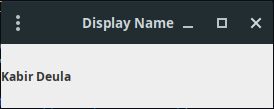
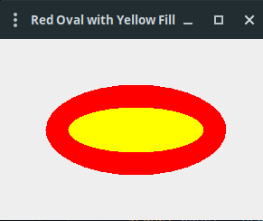
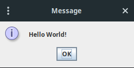

# Lab 

|  S.N. |                                                                                           Topic                                                                                           |  Date  | Status |
| :---: | :---------------------------------------------------------------------------------------------------------------------------------------------------------------------------------------- | :----- | :----- |
| 1.    | [Display your Name using Java Swing.](#lab-1)                                                                                                                                             | Mar 28 | Done   |
| 2.    | [Display Green Line using Java Swing.](#lab-2)                                                                                                                                            | Mar 28 | Done   |
| 3.    | [Display Red Oval Shape with Yellow fill using Java Swing.](#lab-3)                                                                                                                       | Mar 28 | Done   |
| 4.    | [WAP to create a dialog box using Java Swing.]()                                                                                                                                                      |        | Done   |
| 5.    | [WAP to create a Menu and Sub Menu in Java Swing.]()                                                                                                                                                      |        | ToDo   |
| 6.    | [WAP to illustrate Border Layout.]()                                                                                                                                                       |        | ToDo   |
| 7.    | [WAP to illustrate Grid Layout.]()                                                                                                        |        | Done   |
| 8.    | [Write a swing program to add two numbers taken from textbox and display the result in third textbox. The result should be displayed when a user clicks the button.](#lab-8)                                                                                                                 |        | Done   |
| 9.    | Make a Student Registration Page. Insert data from registration page to database named student.                                                                                                                                  |        | ToDo   |
| 10.   | Make a Student Listing Page. Retrieve the data from student table and list items.                                                                                                                                  |        | ToDo   |
| 11.   | Use prepared statements to insert 5 student record in database, modify 3rd record, delete 4th record and display the remaining records in console.                                                                                                                                                               |        | ToDo   |

## Lab 1

### Source Code

```java
import javax.swing.*;

public class NameJavaSwing extends JFrame{
    private JLabel nameLabel;

    public NameJavaSwing(){
        setTitle("Display Name");
        nameLabel = new JLabel("Kabir Deula");
        getContentPane().add(nameLabel);
        setSize(200, 100);
        setVisible(true);
        setDefaultCloseOperation(JFrame.EXIT_ON_CLOSE);
    }

    public static void main(String[] args) {
        new NameJavaSwing();
    }
}
```

### Output



## Lab 2

### Source Code

```java
import javax.swing.*;
import java.awt.*;

public class GreenLine extends JFrame{
    public GreenLine(){
        setTitle("Display Green Line");

        JPanel panel = new JPanel(){
            @Override
            protected void paintComponent(Graphics graphics) {
                super.paintComponent(graphics);
                graphics.setColor(Color.GREEN);
                graphics.drawLine(50, 50, 250, 250);
            }
        };

        getContentPane().add(panel);
        setSize(300, 100);
        setVisible(true);
        setDefaultCloseOperation(JFrame.EXIT_ON_CLOSE);
    }
    public static void main(String[] args) {
        new GreenLine();
    }
}
```

## Lab 3

### Source Code

```java
import java.awt.*;
import javax.swing.*;

public class DisplayRedOval {
    public static void main(String[] args) {
        // Create a JFrame
        JFrame frame = new JFrame("Red Oval with Yellow Fill");
        frame.setDefaultCloseOperation(JFrame.EXIT_ON_CLOSE);

        // Create a JPanel to draw on
        JPanel panel = new JPanel() {
            @Override
            protected void paintComponent(Graphics g) {
                super.paintComponent(g);
                g.setColor(Color.RED);
                g.fillOval(50, 50, 200, 100);
                g.setColor(Color.YELLOW);
                g.fillOval(75, 75, 150, 50);
            }
        };

        // Set the preferred size of the JPanel
        panel.setPreferredSize(new Dimension(300, 200));

        // Add the panel to the JFrame
        frame.getContentPane().add(panel);

        // Pack the JFrame and make it visible
        frame.pack();
        frame.setVisible(true);
    }
}
```

### Output



## Lab 4

### Source Code

```java
import javax.swing.*;

public class DialogBox {
    JFrame frame;

    public DialogBox(){
        frame = new JFrame("Dialog Box");
        JOptionPane.showMessageDialog(frame, "Hello World!");
    }

    public static void main(String[] args) {
        new DialogBox();
    }
}
```

### Output



## Lab 5

### Source Code

```java

```

### Output

```
```

## Lab 6

### Source Code

```java

```

### Output

```
```

## Lab 7

### Source Code

```java
```

### Output

```
```

## Lab 8

### Source Code

```java
```

### Output

```
```

## Lab 12

### Source Code

```java

```

### Output

```
```

## Lab 13

### Source Code

```java

```

### Output

```
```