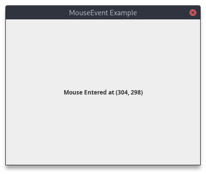

# Lab

| S.N. | Topic                                                                                                                                                                                                                                                                                                                                                                                                                                                                                                                                                                      | Date       | Status |
| :--: | :------------------------------------------------------------------------------------------------------------------------------------------------------------------------------------------------------------------------------------------------------------------------------------------------------------------------------------------------------------------------------------------------------------------------------------------------------------------------------------------------------------------------------------------------------------------------- | :--------- | :----- |
|  1.  | [Write a program to create interface A in this interface we have two method method1 and method2. Implement this interface in another class named MyClass.](#lab-1)                                                                                                                                                                                                                                                                                                                                                                                                         | 2023/04/11 | Done   |
|  2.  | [Write a program for example of multiple catch statements occuring in a program.](#lab-2)                                                                                                                                                                                                                                                                                                                                                                                                                                                                                  | 2023/04/11 | Done   |
|  3.  | [Write a program to create a dialogbox and menu.](#lab-3)                                                                                                                                                                                                                                                                                                                                                                                                                                                                                                                  | 2023/04/13 | Done   |
|  4.  | [Write a program that will display checkboxes and option buttons they are numbered from 1 to 10. Use a textbox to display the number those corresponding boxes or button checked.](#lab-4)                                                                                                                                                                                                                                                                                                                                                                                 | 2023/04/13 | Done   |
|  5.  | [Write a program using swing components to add two numbers. Use text fields for inputs and output. Your program should display the result when the user presses a button.](#lab-5)                                                                                                                                                                                                                                                                                                                                                                                         | 2023/04/16 | Done   |
|  6.  | [Write a program to illustrate BorderLayout.](#lab-6)                                                                                                                                                                                                                                                                                                                                                                                                                                                                                                                      | 2023/04/16 | Done   |
|  7.  | [Write a program to illustrate MouseEvent and MouseListener Interface.](#lab-7)                                                                                                                                                                                                                                                                                                                                                                                                                                                                                            | 2023/04/18 | Done   |
|  8.  | [Write a program using JDBC to insert data to database.](#lab-8)                                                                                                                                                                                                                                                                                                                                                                                                                                                                                                           | 2023/04/18 | Done   |
|  9.  | [Write a program using JDBC to retrieve data from database.](#lab-9)                                                                                                                                                                                                                                                                                                                                                                                                                                                                                                       | 2023/04/21 | Done   |
| 10.  | [Write an example of PreparedStatement.](#lab-10)                                                                                                                                                                                                                                                                                                                                                                                                                                                                                                                          | 2023/04/21 | Done   |
| 11.  | [Write an example of RowSet.](#lab-11)                                                                                                                                                                                                                                                                                                                                                                                                                                                                                                                                     | 2023/04/25 | Done   |
| 12.  | [Write a program to illustrate JavaBeans.](#lab-12)                                                                                                                                                                                                                                                                                                                                                                                                                                                                                                                        | 2023/04/28 | Done   |
| 13.  | [Write a program using Servlet to print Hello. Also write the web.xml file.](#lab-13)                                                                                                                                                                                                                                                                                                                                                                                                                                                                                      | 2023/05/02 | ToDo   |
| 14.  | [Write a program using Servlet to sum two numbers.](#lab-14)                                                                                                                                                                                                                                                                                                                                                                                                                                                                                                               | 2023/05/09 | ToDo   |
| 15.  | [Write a program using Servlet to set cookies values and get these values.](#lab-15)                                                                                                                                                                                                                                                                                                                                                                                                                                                                                       | 2023/05/12 | ToDo   |
| 16.  | [Write a JSP program to display contents of data entered from any form.](#lab-16)                                                                                                                                                                                                                                                                                                                                                                                                                                                                                          | 2023/05/16 | ToDo   |
| 17.  | [Write a JSP program to demonstrate exception handling.](#lab-17)                                                                                                                                                                                                                                                                                                                                                                                                                                                                                                          | 2023/05/30 | ToDo   |
| 18.  | [Write a JSP program to print "NCCS College" 10 times.](#lab-18)                                                                                                                                                                                                                                                                                                                                                                                                                                                                                                           | 2023/06/02 | ToDo   |
| 19.  | [Write a RMI program to subtract between two numbers.](#lab-19)                                                                                                                                                                                                                                                                                                                                                                                                                                                                                                            | 2023/06/06 | ToDo   |
| 20.  | [Write a program to design an interface containing fields User ID, Password and Account type, and buttons login, cancel, edit by mixing border layout and flow layout. Add events handling to the button login and cancel such that click in in login checks for matching user id and password in the database and opens another window if login checks for matching user id and password in the database and opens another window if login is successfuk and displays appropriate message if login is not successful. Clicking in cancel terminates our program](#lab-20) | 2023/06/09 | ToDo   |

## Lab 1

### Source Code

```java
interface InterfaceA {
    void method1();
    void method2();
}

public class MyClass implements InterfaceA{
    @Override
    public void method1(){
        System.out.println("Implementing method 1");
    }

    @Override
    public void method2(){
        System.out.println("Implementing method 2");
    }

    public static void main(String[] args) {
        MyClass obj = new MyClass();
        obj.method1();
        obj.method2();
    }
}
```

### Output

```
Implementing method 1
Implementing method 2
```

[Go to Top](#lab)

[Main File](/Lab/20230616/MyClass.java)

## Lab 2

### Source Code

```java
public class MultipleCatchDemo {
    public static void main(String[] args) {
        try {
            int result = divide(10, 0);
            System.out.println("Result: " + result);
        } catch (ArithmeticException e) {
            System.out.println("ArithmeticException occurred: " + e.getMessage());
        } catch (ArrayIndexOutOfBoundsException e) {
            System.out.println("ArrayIndexOutOfBoundsException occurred: " + e.getMessage());
        } catch (Exception e) {
            System.out.println("Exception occurred: " + e.getMessage());
        }
    }

    public static int divide(int num1, int num2) {
        return num1 / num2;
    }
}
```

### Output

```
ArithmeticException occurred: / by zero
```

[Go to Top](#lab)

[Main File](/Lab/20230616/MultipleCatchDemo.java)

## Lab 3

### Source Code

```java
import java.awt.event.*;
import javax.swing.*;

public class DialogBoxAndMenuDemo {
    public static void main(String[] args) {
        JFrame frame = new JFrame("Dialog Box and Menu Example");
        frame.setSize(400, 300);
        frame.setDefaultCloseOperation(JFrame.EXIT_ON_CLOSE);

        JMenuBar menuBar = new JMenuBar();
        
        JMenu fileMenu = new JMenu("File");
        
        JMenuItem openItem = new JMenuItem("Open");
        JMenuItem saveItem = new JMenuItem("Save");
        JMenuItem exitItem = new JMenuItem("Exit");

        fileMenu.add(openItem);
        fileMenu.add(saveItem);
        fileMenu.addSeparator();
        fileMenu.add(exitItem);

        menuBar.add(fileMenu);

        frame.setJMenuBar(menuBar);

        openItem.addActionListener(new ActionListener(){
            public void actionPerformed(ActionEvent e){
                JOptionPane.showMessageDialog(frame, "Open Menu Item Selected.");
            }
        });

        saveItem.addActionListener(new ActionListener() {
            public void actionPerformed(ActionEvent e){
                JOptionPane.showMessageDialog(frame, "Save Menu Item Selected.");
            }
        });

        exitItem.addActionListener(new ActionListener() {
            public void actionPerformed(ActionEvent e) {
                System.exit(0);
            }
        });

        frame.setVisible(true);
    }
}

```

### Output


[Go to Top](#lab)

[Main File](/Lab/20230616/DialogBoxAndMenuDemo.java)

## Lab 4

### Source Code

```java
import javax.swing.*;
import java.awt.*;
import java.awt.event.*;

public class CheckboxAndRadioButtonDemo {
    private JFrame frame;
    private JTextField textField;
    private JCheckBox[] checkboxes;
    private JRadioButton[] radioButtons;

    public CheckboxAndRadioButtonDemo() {
        frame = new JFrame("Checkbox and Radio Button Example.");
        frame.setSize(400, 350);
        frame.setDefaultCloseOperation(JFrame.EXIT_ON_CLOSE);

        JPanel panel = new JPanel();
        panel.setLayout(new GridLayout(12, 1));

        textField = new JTextField(10);

        JLabel checkboxLabel = new JLabel("Checkboxes: ");
        panel.add(checkboxLabel);

        checkboxes = new JCheckBox[10];
        for (int i = 0; i < checkboxes.length; i++) {
            checkboxes[i] = new JCheckBox("Checkbox " + (i + 1));
            checkboxes[i].addItemListener(new CheckboxListener());
            panel.add(checkboxes[i]);
        }

        JLabel radioButtonLabel = new JLabel("Radio Buttons: ");
        panel.add(radioButtonLabel);

        ButtonGroup buttonGroup = new ButtonGroup();
        radioButtons = new JRadioButton[10];
        for (int i = 0; i < radioButtons.length; i++) {
            radioButtons[i] = new JRadioButton("Option " + (i + 1));
            radioButtons[i].addItemListener(new RadioButtonListener());
            buttonGroup.add(radioButtons[i]);
            panel.add(radioButtons[i]);
        }

        panel.add(textField);

        frame.add(panel);
        frame.setVisible(true);
    }

    private class CheckboxListener implements ItemListener {
        public void itemStateChanged(ItemEvent e) {
            String selected = "";
            for (JCheckBox checkBox : checkboxes) {
                if (checkBox.isSelected()) {
                    selected += checkBox.getText() + " ";
                }
            }
            textField.setText(selected.trim());
        }
    }

    public class RadioButtonListener implements ItemListener {
        public void itemStateChanged(ItemEvent e) {
            String selected = "";
            for (JRadioButton radioButton : radioButtons) {
                if (radioButton.isSelected()) {
                    selected = radioButton.getText();
                    break;
                }
            }
            textField.setText(selected);
        }
    }

    public static void main(String[] args) {
        SwingUtilities.invokeLater(new Runnable() {
            public void run() {
                new CheckboxAndRadioButtonDemo();
            }
        });
    }

}
```

### Output


[Go to Top](#lab)

[Main File](/Lab/20230616/CheckboxAndRadioButtonDemo.java)

## Lab 5

### Source Code

```java
import javax.swing.*;
import java.awt.*;
import java.awt.event.*;

public class SwingSum {
    private JFrame frame;
    private JTextField num1TextField, num2TextField, resultTextField;

    public SwingSum() {
        frame = new JFrame("Sum of Two Numbers.");
        frame.setSize(330, 200);
        frame.setDefaultCloseOperation(JFrame.EXIT_ON_CLOSE);

        JPanel panel = new JPanel(new GridBagLayout());
        panel.setLayout(new GridLayout(4, 2));

        JLabel num1Label = new JLabel("Number 1:");
        num1TextField = new JTextField(10);
        panel.add(num1Label);
        panel.add(num1TextField);

        JLabel num2Label = new JLabel("Number 2:");
        num2TextField = new JTextField(10);
        panel.add(num2Label);
        panel.add(num2TextField);

        JButton addButton = new JButton("Sum");
        addButton.addActionListener(new ButtonListener());
        panel.add(addButton);

        JLabel resultLabel = new JLabel("Result:");
        resultTextField = new JTextField(10);
        resultTextField.setEditable(false);
        panel.add(resultLabel);
        panel.add(resultTextField);

        frame.add(panel);
        frame.setVisible(true);
    }

    private class ButtonListener implements ActionListener {
        public void actionPerformed(ActionEvent e) {
            try {
                int num1 = Integer.parseInt(num1TextField.getText());
                int num2 = Integer.parseInt(num2TextField.getText());
                int sum = num1 + num2;
                resultTextField.setText(String.valueOf(sum));
            } catch (Exception error) {
                JOptionPane.showMessageDialog(frame, "Invalid input! Please enter valid numbers.");
            }
        }
    }

    public static void main(String[] args) {
        SwingUtilities.invokeLater(new Runnable() {
            public void run() {
                new SwingSum();
            }
        });
    }
}
```

### Output


[Go to Top](#lab)

[Main File](/Lab/20230616/SwingSum.java)

## Lab 6

### Source Code

```java
import javax.swing.*;
import java.awt.*;

public class BorderLayoutDemo {
    public static void main(String[] args) {
        JFrame frame = new JFrame("Border Layout Demo");
        frame.setSize(400, 300);

        JButton eastButton = new JButton("East");
        JButton westButton = new JButton("West");
        JButton northButton = new JButton("North");
        JButton southButton = new JButton("South");
        JButton centerButton = new JButton("Center");
        
        frame.add(eastButton, BorderLayout.EAST);
        frame.add(northButton, BorderLayout.NORTH);
        frame.add(centerButton, BorderLayout.CENTER);
        frame.add(westButton, BorderLayout.WEST);
        frame.add(southButton, BorderLayout.SOUTH);

        frame.setVisible(true);
    }
}
```

### Output


[Go to Top](#lab)

[Main File](/Lab/20230616/BorderLayoutDemo.java)

## Lab 7

### Source Code

```java
import javax.swing.*;
import java.awt.*;
import java.awt.event.*;

public class MouseEventDemo implements MouseListener {
    private JFrame frame;
    private JLabel label;

    public MouseEventDemo() {
        frame = new JFrame("MouseEvent Example");
        frame.setSize(400, 300);
        frame.setDefaultCloseOperation(JFrame.EXIT_ON_CLOSE);

        label = new JLabel("No Mouse Event Yet.");
        label.setHorizontalAlignment(SwingConstants.CENTER);

        frame.addMouseListener(this);
        frame.add(label);
        frame.setVisible(true);
    }

    public void mouseClicked(MouseEvent e) {
        label.setText("Mouse Clicked at (" +  e.getX() + ", " + e.getY() + ")");
    }
    public void mousePressed(MouseEvent e) {
        label.setText("Mouse Pressed at (" +  e.getX() + ", " + e.getY() + ")");
    }
    public void mouseReleased(MouseEvent e) {
        label.setText("Mouse Released at (" +  e.getX() + ", " + e.getY() + ")");
    }
    public void mouseEntered(MouseEvent e) {
        label.setText("Mouse Entered at (" +  e.getX() + ", " + e.getY() + ")");
    }
    public void mouseExited(MouseEvent e) {
        label.setText("Mouse Exited at (" +  e.getX() + ", " + e.getY() + ")");
    }

    public static void main(String[] args) {
        new MouseEventDemo();
    }
}
```

### Output





[Go to Top](#lab)

[Main File](/Lab/20230616/MouseEventDemo.java)

## Lab 8

### Source Code

```java
import java.sql.*;

public class InsertDataDemo {
    public static void main(String[] args) {
        try {
            Class.forName("com.mysql.cj.jdbc.Driver");
            Connection connection = DriverManager.getConnection("jdbc:mysql://localhost:3306/nccs", "java", "lunala");

            Statement statement = connection.createStatement();

            statement.executeUpdate("INSERT INTO bcaSix VALUES (6, 'Chiran Rai', 'Dallu'),(7, 'Kabir Deula', 'Chetrapati'), (8, 'Kabita Phuyal', 'Pepsicola'), (9, 'Kiran Manandhar', 'Basantapur'), (10, 'Manish Pandey', 'Godawari')");
            connection.close();
        } catch (Exception e) {
            System.err.println("Got an exception");
            System.err.println(e.getMessage());
        }
    }
}
```

[Go to Top](#lab)

[Main File](/Lab/20230616/InsertDataDemo.java)

## Lab 9

### Source Code

```java
import java.sql.*;

public class RetrieveDataDemo {
    public static void main(String[] args) {
        try {
            Connection connection = DriverManager.getConnection("jdbc:mysql://localhost:3306/nccs", "java", "lunala");

            Statement statement = connection.createStatement();

            ResultSet resultSet = statement.executeQuery("SELECT * FROM students");

            while (resultSet.next()) {
                int id = resultSet.getInt("id");
                String name = resultSet.getString("name");
                int age = resultSet.getInt("age");
                String grade = resultSet.getString("grade");

                System.out.println("ID: " + id + "\nName: " + name + "\nAge: " + age + "\nGrade: " + grade);
                System.out.println("-------------------------");
            }

            resultSet.close();
            statement.close();
            connection.close();
        } catch (Exception e) {
            e.printStackTrace();
        }
    }
}
```

### Output

```
ID: 1
Name: Aayush Manandhar
Age: 20
Grade: A
-------------------------
ID: 2
Name: Bhuwan Singh
Age: 20
Grade: B
-------------------------
```

[Go to Top](#lab)

[Main File](/Lab/20230616/RetrieveDataDemo.java)

## Lab 10

### Source Code

```java
import java.sql.*;

public class PreparedStatementDemo {
    public static void main(String[] args) {
        try {
            Connection connection = DriverManager.getConnection("jdbc:mysql://localhost:3306/nccs", "java", "lunala");

            PreparedStatement statement = connection.prepareStatement("INSERT INTO students (name, age, grade) VALUES (?, ?, ?)");

            statement.setString(1, "Aayush Manandhar");
            statement.setInt(2, 20);
            statement.setString(3, "A");

            statement.setString(1, "Bhuwan Singh");
            statement.setInt(2, 20);
            statement.setString(3, "B");

            int rowsAffected = statement.executeUpdate();

            if(rowsAffected > 0){
                System.out.println("Data Inserted Successfully.");
            }else{
                System.out.println("Data Insertion Failed.");
            }

            statement.close();
            connection.close();
        } catch (SQLException e) {
            e.printStackTrace();
        }
    }
}
```

### Output

```
Data Inserted Successfully.
```

[Go to Top](#lab)

[Main File](/Lab/20230616/PreparedStatementDemo.java)

## Lab 11

### Source Code

```java
import java.sql.*;
import javax.sql.rowset.JdbcRowSet;
import javax.sql.rowset.RowSetProvider;

public class RowSetDemo {
    public static void main(String[] args) throws SQLException {

        JdbcRowSet rowSet = RowSetProvider.newFactory().createJdbcRowSet();

        rowSet.setUrl("jdbc:mysql://localhost:3306/nccs");
        rowSet.setUsername("java");
        rowSet.setPassword("lunala");

        rowSet.setCommand("SELECT * FROM students");
        rowSet.execute();

        while (rowSet.next()) {
            System.out.println("ID: " + rowSet.getInt("id") + "\nName: " + rowSet.getString("name") + "\nAge: " + rowSet.getInt("age") + "\nGrade: " + rowSet.getString("grade"));
            System.out.println("-------------------------");
        }
        rowSet.close();
    }
}
```

### Output

```
ID: 1
Name: Aayush Manandhar
Age: 20
Grade: A
-------------------------
ID: 2
Name: Bhuwan Singh
Age: 20
Grade: B
-------------------------
```

[Go to Top](#lab)

[Main File](/Lab/20230616/RowSetDemo.java)

## Lab 12

### Source Code

```java
import java.beans.*;

public class BeanDemo {
    private String name;
    private int age;

    public BeanDemo() {
    }

    public String getName() {
        return name;
    }

    public void setName(String name) {
        this.name = name;
    }

    public int getAge() {
        return age;
    }

    public void setAge(int age) {
        this.age = age;
    }

    public static void main(String[] args) {
        try {
            BeanDemo bean = new BeanDemo();
            BeanInfo beanInfo = Introspector.getBeanInfo(BeanDemo.class);

            PropertyDescriptor[] propertyDescriptors = beanInfo.getPropertyDescriptors();

            for (PropertyDescriptor propertyDescriptor : propertyDescriptors) {
                String propertyName = propertyDescriptor.getName();

                if (propertyDescriptor.getWriteMethod() != null) {
                    if(propertyName.equals("name")){
                        propertyDescriptor.getWriteMethod().invoke(bean, "Kabir Deula");
                    }else if(propertyName.equals("age")){
                        propertyDescriptor.getWriteMethod().invoke(bean, 22);
                    }
                }
            }

            System.out.println("Name: " + bean.getName());
            System.out.println("Age: " + bean.getAge());
        } catch (Exception e) {
            e.printStackTrace();
        }
    }
}
```

### Output

```
Name: Kabir Deula
Age: 22
```

[Go to Top](#lab)

[Main File](/Lab/20230616/BeanDemo.java)

## Lab 13

### Source Code

HelloServlet.java
```java
import java.io.*;

import javax.servlet.*;
import javax.servlet.http.*;

public class HelloServlet extends HttpServlet {
    protected void doGet(HttpServletRequest request, HttpServletResponse response)
            throws ServletException, IOException {
        response.setContentType("text/html");
        PrintWriter out = response.getWriter();
        out.println("<html><head><title>Hello Servlet</title></head><body>");
        out.println("<h1>Hello</h1>");
        out.println("</body></html>");
    }
}
```

web.xml
```xml
<!DOCTYPE web-app PUBLIC
 "-//Sun Microsystems, Inc.//DTD Web Application 2.3//EN"
 "http://java.sun.com/dtd/web-app_2_3.dtd" >

<web-app>
  <display-name>Hello Servlet</display-name>
  <servlet>
    <servlet-name>HelloServlet</servlet-name>
    <servlet-class>HelloServlet</servlet-class>
  </servlet>
  <servlet-mapping>
    <servlet-name>HelloServlet</servlet-name>
    <url-pattern>/hello</url-pattern>
  </servlet-mapping>
</web-app>
```

### Output


[Go to Top](#lab)

[Main File](/Lab/lab13/src/main/)

## Lab 14

### Source Code

SumServlet.java
```java
import java.io.*;

import javax.servlet.*;
import javax.servlet.http.*;

public class SumServlet extends HttpServlet{
    public void doGet(HttpServletRequest request, HttpServletResponse response) throws ServletException, IOException{
        response.setContentType("text/html");

        PrintWriter out = response.getWriter();
        out.println("<html><head><title>Sum</title><body>");
        out.println("<h1>Sum of Two Numbers</h1>");

        String number1 = request.getParameter("number1");
        String number2 = request.getParameter("number2");

        int sum = 0;
        try {
            int num1 = Integer.parseInt(number1);
            int num2 = Integer.parseInt(number2);
            sum = num1 + num2;

            out.println("<p>Number 1: " + num1 + "</p>");
            out.println("<p>Number 2: " + num2 + "</p>");
            out.println("<p>Sum: " + sum + "</p>");
        } catch (NumberFormatException e) {
            out.println("<p>Error: Invalid input!</p>");
        }

        out.println("</body></html>");
        out.close();
    }
}

```

web.xml
```xml
<!DOCTYPE web-app PUBLIC
 "-//Sun Microsystems, Inc.//DTD Web Application 2.3//EN"
 "http://java.sun.com/dtd/web-app_2_3.dtd" >

<web-app>
  <display-name>SumServlet</display-name>
  <servlet>
        <servlet-name>SumServlet</servlet-name>
        <servlet-class>SumServlet</servlet-class>
    </servlet>
    <servlet-mapping>
        <servlet-name>SumServlet</servlet-name>
        <url-pattern>/sum</url-pattern>
    </servlet-mapping>
</web-app>
```

### Output


[Go to Top](#lab)

[Main File](/Lab/lab14/src/main/)

## Lab 15

### Source Code

CookieServlet.java
```java
import java.io.IOException;
import java.io.PrintWriter;

import javax.servlet.*;
import javax.servlet.http.*;

public class CookieServlet extends HttpServlet{
    public void doGet(HttpServletRequest request, HttpServletResponse response) throws ServletException, IOException{
        response.setContentType("text/html");

        PrintWriter out = response.getWriter();
        out.println("<html><body>");
        out.println("<h2>Cookie Example</h2>");

        Cookie[] cookies = request.getCookies();

        if (cookies != null) {
            for (Cookie cookie : cookies) {
                String name = cookie.getName();
                String value = cookie.getValue();
                out.println("<p>Cookie Name: " + name + "</p><p>Value: " + value + "</p>");
            }
        }

        Cookie cookie1 = new Cookie("username", "kabirdeula");
        cookie1.setMaxAge(24 * 60 * 60);
        response.addCookie(cookie1);
        
        Cookie cookie2 = new Cookie("language", "java");
        cookie2.setMaxAge(24 * 60 * 60);
        response.addCookie(cookie2);
        
        out.println("<p>Cookies have been set.</p></body></html>");
        out.close();
    }
}
```

web.xml
```xml
<!DOCTYPE web-app PUBLIC
 "-//Sun Microsystems, Inc.//DTD Web Application 2.3//EN"
 "http://java.sun.com/dtd/web-app_2_3.dtd" >

<web-app>
  <display-name>Servlet Cookies</display-name>
  <servlet>
    <servlet-name>CookieServlet</servlet-name>
    <servlet-class>CookieServlet</servlet-class>
  </servlet>
  <servlet-mapping>
    <servlet-name>CookieServlet</servlet-name>
    <url-pattern>/cookie</url-pattern>
  </servlet-mapping>
</web-app>
```

### Output


[Go to Top](#lab)

[Main File](/Lab/lab15/src/main/)

## Lab 16

### Source Code

index.jsp
```jsp
<%@ page language="java" contentType="text/html; charset=UTF-8" pageEncoding="UTF-8"%>
<!DOCTYPE html>
<html lang="en">
<head>
    <meta charset="UTF-8">
    <meta name="viewport" content="width=device-width, initial-scale=1.0">
    <title>Form Data Display</title>
</head>
<body>
    <h1>Form Data Display</h1>
    <form action="display.jsp" method="post">

        <label for="name">Name:</label>
        <input type="text" name="name" id="name"><br/>
        
        <label for="email">Email:</label>
        <input type="email" name="email" id="email"><br/>
        
        <label for="message">Message:</label>
        <textarea name="message" id="message" cols="40" rows="5"></textarea><br/>
        <input type="submit" value="Submit">
    </form>
</body>
</html>
```

display.jsp
```jsp
<%@ page language="java" contentType="text/html; charset=UTF-8" pageEncoding="UTF-8"%>
<!DOCTYPE html>
<html lang="en">
<head>
    <meta charset="UTF-8">
    <meta name="viewport" content="width=device-width, initial-scale=1.0">
    <title>Form Data Display</title>
</head>
<body>
    <h1>Form Data Display</h1>
    <p><strong>Name:</strong> <%= request.getParameter("name") %></p>
    <p><strong>Email:</strong> <%= request.getParameter("email") %></p>
    <p><strong>Message:</strong> <%= request.getParameter("message") %></p>
</body>
</html>
```

### Output


[Go to Top](#lab)

[Main File](/Lab/lab16/src/main/webapp/)

## Lab 17

### Source Code

```java

```

### Output

[Go to Top](#lab)

[Main File](/Lab/)

## Lab 18

### Source Code

```java

```

### Output

[Go to Top](#lab)

[Main File](/Lab/)

## Lab 19

### Source Code

```java

```

### Output

[Go to Top](#lab)

[Main File](/Lab/)

## Lab 20

### Source Code

```java

```

### Output

[Go to Top](#lab)

[Main File](/Lab/)
